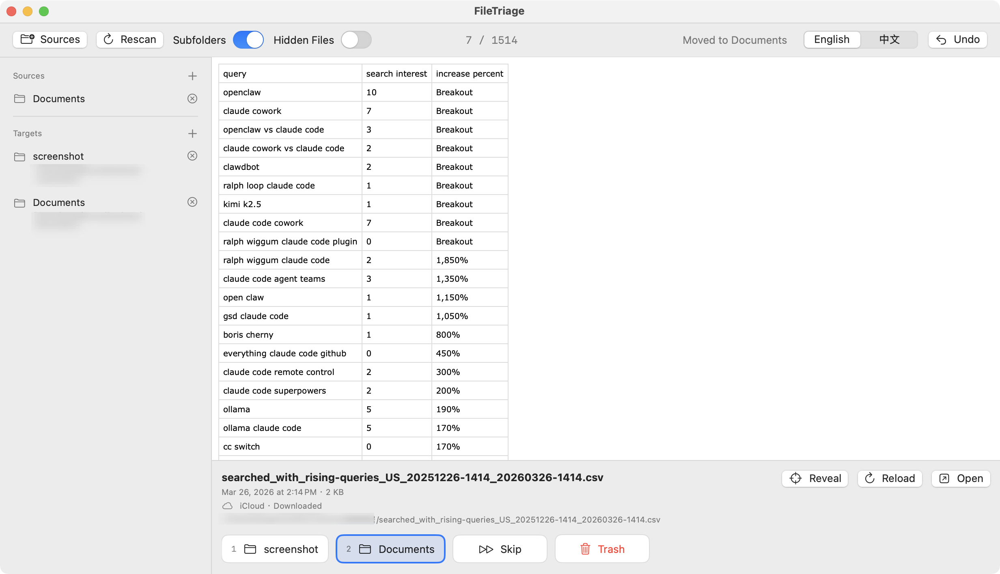

# File Triage for macOS

[简体中文](README.zh-CN.md)

A native macOS prototype for quickly sorting messy folders. It uses SwiftUI, AppKit, and Quick Look.



## Run

```bash
cd apps/mac
swift run FileTriage
```

Or run:

```bash
./run.sh
```

## Package a Local Test Build

```bash
./package_app.sh
```

The build output is generated at:

```text
apps/mac/dist/File Triage.zip
```

This is a local test build without official Apple Developer signing. First launch may require right-clicking the app and choosing Open, or allowing it in System Settings > Privacy & Security.

## Features

- Pick one or more source folders.
- Remove source folders and rescan.
- Preview files with macOS Quick Look.
- Add and remove target folders.
- Sort with buttons directly below the preview.
- Undo with the top-right button or `Command-Z`.
- Show file creation time, size, and full path.
- Reveal the current file in Finder or open it with the default app.
- Show iCloud status, download cloud-only files, and reload previews.
- Use `Left` / `Right` to select an action, then `Return` to execute.
- Use number keys `1` through `9` for the first nine targets.
- Move files to macOS Trash with `Delete`.
- Skip with `Space`.
- Optionally include subfolders and hidden files.
- Switch between English and Chinese. English is the default.
